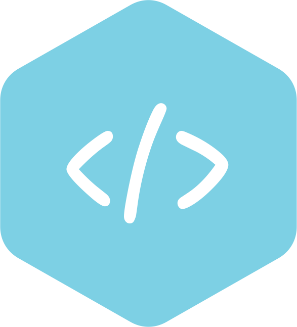

#  GOPACK
* [Introduction][intro]
* [Installation][install]
* [Usage][use]
* > [Initialization][init]
* > [Starting the development server][start]
* > [Starting the production server][serve]
* > [Bundling your project][build]
* > [Using the `gopack.config.js` file][gopackConfig]
* [Other libraries and frameworks][other]
* > [Supporting React Js][react]
* > [Supporting Typescript][typescript]
* > [Supporting SASS/SCSS][sass]

[intro]: #introduction
[install]: #installation
[use]: #usage
[init]: #initialization
[start]: #start
[serve]: #serve
[build]: #build
[gopackConfig]: #gopackconfig
[other]: #libraries
[react]: #react
[typescript]: #typescript
[sass]: #sass

## Introduction
GOPack is a pre written javascript bundler, which was created using webpack. It configures your project to use the already existing webpack loaders and plugins to generate static files.

## Installation
Inorder to install this package you need to have Node Js running on your system. If you don't have Node Js you can install it from their website [https://nodejs.org](https://nodejs.org). If you have Node Js installed, navigate to your project root folder and run `npm i @go-pack/gopack` in your terminal.

## Usage
### Initialization
To initialize the project (Set up the project files), run `npx gopack init`. This command will create the files you need for webpack to work, and install the `devDependencies` into your `node_modules` folder.
The files that will be created are:
- package.json (This will merge existing package.json contents into a new package.json file)
- webpack.config.js
- .browserslistrc
- postcss.config.js
- gopack.config.js

When you run `npx gopack init`, it will initialize your project and create some files, but if it files any existing file it will ask for permission to overwrite it. It will also ask for permission to run `npm install -f` in your project. To skip the permissions you can run `npx gopack init -y` 


### Start
Inorder to start the development server, you can run `npx gopack start`, the equivalent of this is `npx webpack` + `npx webpack serve`. Your server will run on `http://localhost:8080` by default. Make sure you have the `gopack.config.js` file in your project's root folder and export an object as default, unless this will throw an error.

### Serve
Inorder to start the production server, you can run `npx gopack serve`, the equivalent of this is `npx cross-env MODE=production webpack` + `npx cross-env MODE=production webpack serve`. Your server will run on `http://localhost:8080` by default. Make sure you have the `gopack.config.js` file in your project's root folder and export an object as default, unless this will throw an error.

### Build
Inorder to bundle your project into static files, you can run `npx gopack build`, the equivalent of this is `npx cross-env MODE=production webpack`. Doing this will bundle your project without starting the production server. Make sure you have the `gopack.config.js` file in your project's root folder and export an object as default, unless this will throw an error.

### GopackConfig
The `gopack.config.js` file is written to help developers who are not familiar with webpack to customize the build output to their taste.

It comprises of key value pairs that enables flexibility in one's project. Which are:
- [generateCSSFiles][generateCSSFiles]
-  [devtool][devtool]
-  [useCoreJs][useCoreJs]
-  [entry][entry]
- [outputFilenameFormat][outputFilenameFormat] 
- [outputFilename][outputFilename]
- [outputFolder][outputFolder]
-  [pages][pages]
-  [assetsFolder][assetsFolder]

[generateCSSFiles]: #generatecssfiles
[devtool]: #devtool
[useCoreJs]: #usecorejs
[entry]: #entry
[outputFilenameFormat]: #outputfilenameformat
[outputFilename]: #outputfilename
[outputFolder]: #outputfolder
[pages]: #pages
[assetsFolder]: #assetsfolder

#### generateCSSFiles
This accepts a boolean `true` or `false`. It indicates if webpack should inject CSS styles into the style tags `<style></style>` of every HTML page or if it should generate CSS files and them to various HTML pages.

#### devtool
This accepts the same parameters the webpack devtool does. It must be the same parameter that would be inserted into the webpack `devtool` key, unless webpack will throw an error upon build.
The most common used options are either `false` which is a `boolean` or `source-map` which is a `string`. If the `source-map` is inserted, it generates javascript and CSS map files which will be used to trace code using the browser's `devtool`. The `source-map` option is best used for `development` mode, while the `false` option is best used for `production` mode.

#### useCoreJs
This accepts a boolean. It signifies if `babel.config.js` should generate code to support older browser versions when bundling using the `core-js` npm package. It is `false` by default.

**NB: This feature generates a lot of code for backwards compatibility, which will end up making your bundled javascript code large. use at your own risk**

#### entry
This accepts either a `string` or an `object`. It is indicates where webpack should start building our files from. The default value is `./src/index.js`. To specify multiple entrypoint, you create an object with key value pairs. the key being the `chunk` and the value being the *path to the file*. E.g.

```javascript
entry: {
    chunk: 'path/to/file.js'
}
```

### outputFilenameFormat
This is the format in which webpack should name our bundled files - `chunks`. It is used if the `entry` parameter is an `object`. It accepts a string. It is written in this format `[name].bundle.js`. The `[name]` block is a variable which signifies the name each generated file `chunk`. The `bundle` extension is optional, but the `js` extension is compulsory. Therefore, if you specify the entry file as:
```javascript
entry: {
    index: './src/index.js'
}
```
The output will be `index.bundle.js`

#### outputFilename
This is the name you want to give your bundled javascript file. This is used if the `entry` parameter is a `string` or not specified. This key accepts a `string`, which must end with the `.js` extension. E.g. `index.js`

#### outputFolder
This specifies the folder where all the webpack generated files should be located. It accepts a `string`. E.g. `public`

#### pages
This is used if you have more than one HTML file which you want to be bundled alongside other files. It accepts an `array` of `objects`. E.g.
```javascript
public: [
    {
        template: path.resolve(__dirname, "src/index.html"),
        filename: "index.html",
    }
]
```
The template key signifies the path to the HTML document, the filename signifies the name it should give the generated HTML document during build.

Each object also accepts a parameter called `chunk`, which is an array of generated JavaScript/CSS file links to be inserted into the HTML document. The items passed as values to the `chunk` array must be same as the keys passed into the `entry` object. E.g
```javascript
entry: {
    index: './src/index.js',
    about: './src/about.js',
    contact: './src/contact.js',
},
public: [
    {
        template: path.resolve(__dirname, "src/about.html"),
        chunk:["index","about"],
        filename: "about.html",
    }
]
```
#### assetsFolder
This accepts a string which is the name or path to the folder the bundled images and assets will be stored. E.g. `images` or `path/to/images`.

## Libraries
GOPack also supports the use of other libraries which are:

### React
GOPack has built-in support for react. It uses the `@babel/preset-react` library to transpile JSX to javascript. If you need to use React Js in your project you just have to install both the `react` and `react-dom` libraries. Then create a root node in your HTML file where `react` will inject the transpiled JSX code. To learn more about React Js, visit [https://legacy.reactjs.org/docs/getting-started.html](https://legacy.reactjs.org/docs/getting-started.html).

### Typescript
GOPack has built-in support for typescript. It uses the `ts-loader` loader to handle both `.ts` and `.tsx` files. If you need to use Typescript in your project you just need to install the `typescript` library and create a `tsconfig.json` file in your project's root folder. To learn more about Typescript, visit [https://www.typescriptlang.org/docs/handbook/typescript-from-scratch.html](https://www.typescriptlang.org/docs/handbook/typescript-from-scratch.html).

### SASS
GOPack has built-in support for SASS. It uses the `sass-loader` loader to handle both `.sass` and `.scss` files. If you need to use SASS in your project you just need to install the `sass` library in your project. To learn more about SASS, visit [https://sass-lang.com/documentation/](https://sass-lang.com/documentation/).